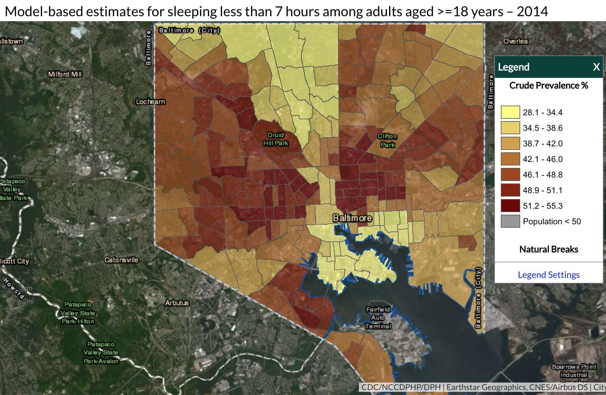

# Deep Learning to Predict Health Outcomes from

# Features of Satellite Images


Abstract—We attempt to classify cancer prevalence by region
using deep learning. We used the existing pre-trained VGGNet
object recognition model as a base, and applied transfer learning
to classify regions by their cancer prevalence. We propose a model
that combines the pre-trained VGGNet model for extracting
higher level features, and two additional linear layers to extract a
relationship between those features and the cancer rates. We show
that this model is able to successfully classify areas by cancer
prevalence given the satellite images of that area as input.

### I. INTRODUCTION

In the last several years, as the amount of satellite imagery
available to the public has increased and deep neural nets have
become much more powerful, the potential of training models
on these images has become apparent. Satellite images contain
a lot of information, but it is often too time consuming for
humans to go through and manually extract information from
them. Recently, many works have been published with the
purpose of extracting useful features from satellite images. In
particular, we are interested in the potential of using satellite
images as an analogue for the built environment. The built en-
vironment is believed to influence a variety of health outcomes.
Training a network on these satellite images could provide
valuable information about the built environment, which in
turn could be correlated with specific health outcomes.

### II. RELATED WORK AND BACKGROUND
One similar paper published by Maharana and Nsoesie
used transfer learning on satellite images with VGGNet to
extract features from the images. Essentially, they used a pre-
trained object recognition model which had been trained on
other datasets, and ran the satellite images through the model
with the idea that the resulting output would contain useful
information about the dataset. They then trained a linear layer
to correlate these features with obesity prevalence. They found
that those features explained 72% to 90% of the variation in
obesity rates between cities [1].
We plan to use a similar approach, except with cancer rates
as a health outcome instead of obesity rates. We will use
satellite images from different regions of the United States
and extract features from these images using a neural network.
We plan to use this neural network to predict cancer rates
on average based on the images of their neighborhood, since
there exist geographic disparities in prevalence. We will get
satellite images and already categorized regions of high or
low prevalence of cancer prevalence to train and validate the
results of our neural network. Our final goal is to produce an
accurate deep learning model to predict the degree of cancer
prevalence in a region based solely on the features extracted
from satellite images.

### III. METHOD AND MODEL


#### A. Dataset

We utilized two different data sets in order to train and
run our model. Firstly, we needed information about the
prevalence of cancer in different locations throughout the
United States. The 500 Cities database from the CDC
provides a prevalence score for the disease in cities all over
the country. Each location is associated with a geolocation,
meaning longitude and latitude, a state, a city, and prevalence
score for cancer. There were multiple datapoints within a
single city. The second part of data collection was finding
satelling imagery for all of the locations that the 500 Cities
database gave us information about. In order to collect these
images, we used the Google Static Maps API to download a
satellite image at each of the geolocations listed by the 500
Cities database that had cancer prevalence scores. Using the
Google Static Maps API we were able to specify zoom level,
size of image, and and exact coordinates.

The 500 Cities database has a heat map that shows preva-
lence of cancer in each city. This helps to visualize the
prevalence and how it relates to the satellite images.


Fig. 1. Heatmap for Prevalence in Baltimore. Shows the prevalence in each
section of Baltimore.


Fig. 2. Satellite Image of Baltimore. Shows the satellite image for Baltimore
as downloaded from Google Static Maps API.

#### B. Preprocessing

With regards to the 500 Cities data that we collected, we
had to perform a few pre-processing steps to make the data
usable. We removed all data points that did not have a cancer
prevalence score. The CDC did not publish prevalence scores
for places where the population was very small, so as not to
skew the data with small sample sizes. In addition, instead of
using the prevalence scores, as a continuous variable, we made
a new variable which was a prevalence category, which has six,
equally sized, ranges from the lowest prevalence score to the
highest prevalence scores. We thought it would be too difficult
for the model to predict prevalence scores to the nearest tenth,
as they were given in the 500 Cities database, so to make the
task simpler, we categorized them into six buckets.
For the satellite images, we sized them to be 224 by 224 since
that was the requirement for the pre-trained VGG network
that we used. In addition, we set the zoom level such that
features such as buildings, roads, bodies of water, fields and
such were visible by eye. This was to ensure that the deep
network would be able to extract meaningful features from
the satellite images.

#### C. Network Architecture

For our deep network we used the VGG-16 model that has
been pretrained on Imagenet. The exact architecture is shown
below. It a series of convolutional and max-pooling layers,
followed by several linear layers to map all the features to
an output. We used transfer learning in order to use the VGG
network to extract features from the satellite images, and then
train one or two new linear layers at the end to map these
features to a prediction of cancer prevalence. The original
architecture of the VGG model.
We experimented using training one new layer at the end,
and then training two linear layers to see which results in the
best accuracy. In addition we tested two different pre-trained
VGG networks, one with batch normalization, and one without
to see which gave the best performance.


D. Loss Function
Since we formulated the problem as a regression, we
experimented with two different loss functions to calculate
a distance between the output of the model and the correct
label. First we tried an L1 loss function, then we tried L2,
or mean squared error loss function. These two loss functions
are shown below. For our model, the loss, during training, was
only back-propagated through the last layer or two after the
original VGG pretrained model.


#### E. Training
We first split the data into 80% training and 20% testing.
From the training data, we extracted the geolocation for each
data point, and used the Google API get the satellite image
of that region. All of these images were downloaded. Then
during the training process, each satellite image was passed
through our model, and a prevalence score (1-6) was generated
as output. This was compared against the known prevalence
score, which was the label, and a loss was computed and step
was taken by the optimizer. We used the Adam optimizer for
training. We had around 30,000 locations, and thus that many
images as well for our dataset.


#### IV. RESULTS AND DISCUSSION
After the training the model in the way described, the
results are shown in figure 4. First we compared training one
linear layer at the end versus training two layers using trans-
fer learning. Using two linear layers improved performance
considerably; the validation loss reached a smaller value than
for one linear layer. Adding more layers improves the fit
of our model to the data since there are more parameters
that can be adjusted, and in general, making a model deeper
makes it better at fitting the given data. The accuracy goes
up significantly when we added and trained two layers versus
just adding and training one.
Next we tests running 10 epochs versus running 20 epochs.
As shown, the validation loss goes down for almost all 20
epochs, and then seems to start stabilizing at the end of the
experiment. Since our validation loss goes down during the
entire experiment, we can conclude that we are not overfitting
the training data, and our model is generalizing well to the
validation data set, because the validation loss, or training loss,
do not start increasing at any point. The accuracy increased
when we increased the epoch count from 10 to 20 as well, as
expected.
We tests two different loss functions, L1 and L2, and as shown
in the figures the L2 loss function better, at least with regards
to validation and training loss. The only issue we thought of
is that it could be possible that the L2 loss, or mean squared
error, results in the algorithm just predicting the mean, just to
reduce the mean squared error, so we tested the accuracy to
see if this was the case. We know this is not the case because
the accuracy of our validation set was better when we used


Fig. 3. Network Architecture.This architecture is the VGG-16 model that has been pretrained on Imagenet. It outputs a vector of features that is 1x1x1000.
We use one or two linear layers to reduce this to 1x1x1.

L2 loss versus when we used L1 loss.
Finally we tested the VGG pretrained network with batch
normalization versus without. In this case, batch normalization
hurt the performance of the model.

```
Validation Accuracy
Model Layer Loss Epochs Accuracy
VGG 	1     L1 10     20.26%
VGG-BN 1      L1 10     22.67%
VGG 	1     L1 20     37.34%
VGG 	1     L2 10     45.70%
VGG 	2     L1 20     55.97%
VGG 	2     L2 20     62.39%
```
Validation Accuracy for Different Models Tested

### V. CONCLUSION

Our aim was to create a deep network that can accurately
predict cancer prevalence based on features of satellite images.
We wanted to develop a model that can map geographical
features from those images to cancer prevalence. We used the
VGG-16 model architecture for the deep network that has been
pretrained on Imagenet, and we trained the last few layers of
the model to be able to map the features that the net extracted
to a prevalence prediction. From our results, it is clear that the
model was able to learn a relation between features of satellite images and prevalence. Our the validation loss on all of our
experiments did go down, so the training process allowed the
model to learn these features. In addition, the accuracy from
the bottom three networks in Table 1 show that the model was
successful in predicting cancer prevalence from satellite image
features.


###VI. FUTURE WORK
In the future, we would like to see what features of the satellite
images correlate to health outcomes.
Our results could be improved additionally by performing
further fine tuning on the VGG model. For example, we only
re-trained one or two additional layers. It's likely that re-
training more layers of the model would improve the accuracy
of the model.
We also may want to experiment with different satellite
resolutions to see what yields the best results. For example,
a more zoomed in picture may be better since it would allow
the model to identify more detailed features such as roads and
vehicles.
Additionally, the VGGNet is used for individual object
recognition within standard photos. While we were still able
to achieve good results with satellite imagery, using a model
which was trained to identify features in satellite imagery in
the first place instead of normal photos might yield better
results. In the paper published by Albert, Kaur, and Gonzlez in
2017, they used a dataset of satellite images of various cities
in Europe to train a model used to identify features in satellite
images [2]. Using a model like this, or retraining the last few
layers of the VGG model on a similar dataset might lead to a
better result.
Finally, other health outcomes in the 500 cities dataset could
be explored using the same approach. Cancer rates may not
correlate extremely well with the built environment no matter
how fine tuned or complex the model is. Therefore, examining
other health outcomes may lead to better and more meaningful
results.


Fig. 4. Test Loss Plots. This figure shows the test loss for each experiment that we tried.


